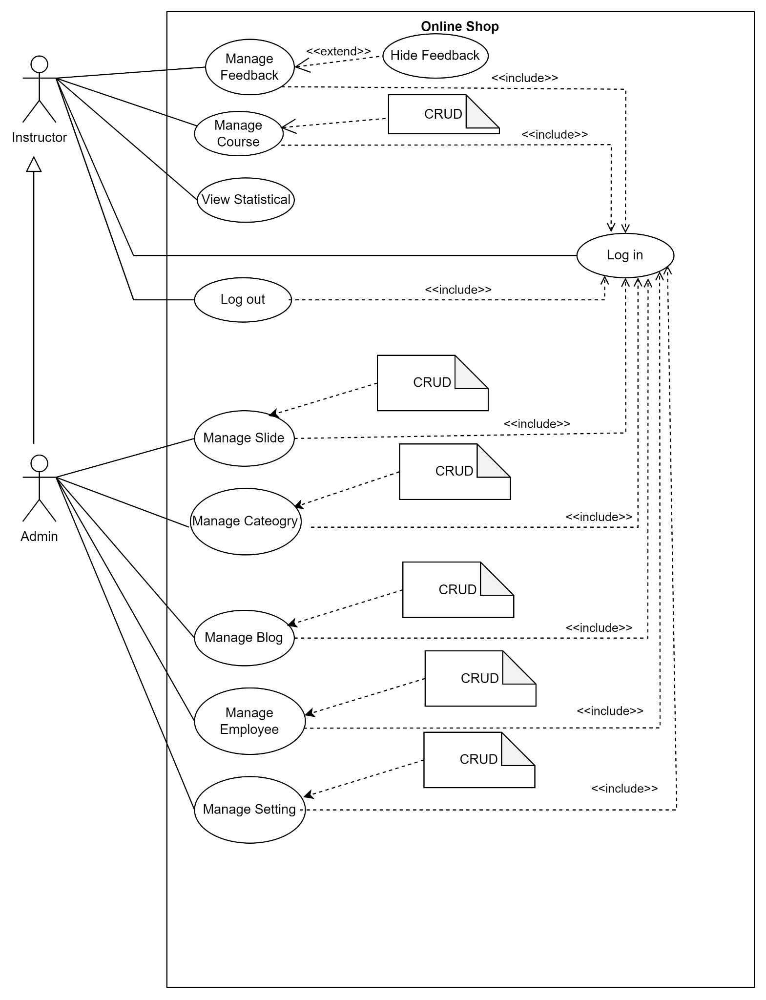
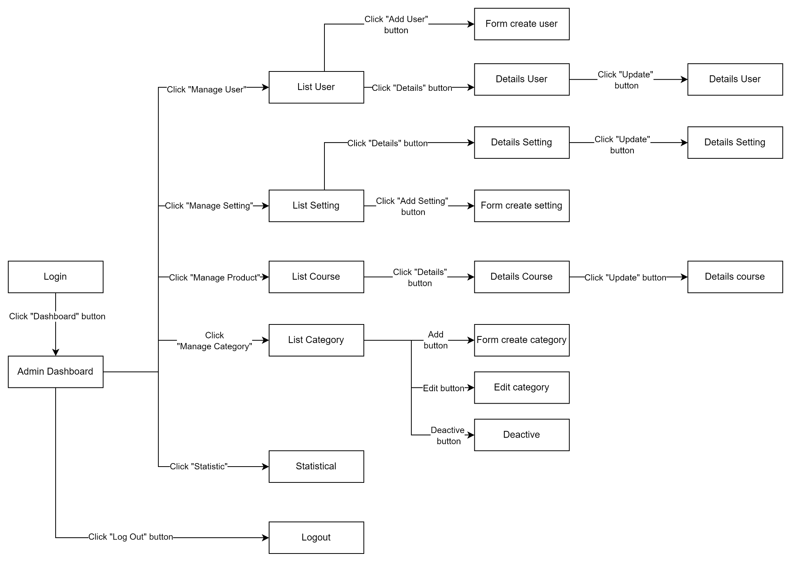

**Online Learning (OCMS)**

# I. Overview

## 1. User Requirements

### 1.1 Actors

### Actors Description

| No. | Actor       | Description                                                                 |
|-----|-------------|-----------------------------------------------------------------------------|
| 1   | Guest       | Unregistered users who can browse available courses, read blog posts, and view public information but cannot enroll in courses. |
| 2   | Student     | Registered users who can enroll in courses, access lessons, take quizzes, track their progress, and view their learning history. |
| 3   | Instructor  | Experts who create and manage course content, upload materials, design quizzes, and review student progress. |
| 4   | Administrator | System manager who oversees user accounts, assigns roles, configures system settings, and ensures overall platform security and functionality. |

### 1.2 Use Cases

#### 1.2.1 UCs for Guest and Customer

{width="6.5in"
height="7.958333333333333in"}

#### 1.2.2 UCs for Instructor and Admin

{width="6.5in" height="8.48611111111111in"}

#### 

## 2. System Functionalities

### 2.1 Screens Flow

### 2.2 Screen Authorization
### Screen Access Matrix

| Screen              | Guest | Student | Instructor | Admin |
|---------------------|:-----:|:-------:|:----------:|:-----:|
| User Login          |   X   |    X    |     X      |   X   |
| User Register       |   X   |    X    |     X      |   X   |
| Reset Password      |   X   |    X    |     X      |   X   |
| User Authorization  |       |    X    |     X      |   X   |
| User Profile        |       |    X    |     X      |   X   |
| Change Password     |       |    X    |     X      |   X   |
| Home                |   X   |    X    |     X      |   X   |
| Blogs List          |   X   |    X    |     X      |   X   |
| Blog Details        |   X   |    X    |     X      |   X   |
| Courses List        |   X   |    X    |     X      |   X   |
| Course Details      |   X   |    X    |     X      |   X   |
| Course Register     |       |    X    |            |       |
| My Registrations    |       |    X    |            |   X   |
| My Courses          |       |    X    |            |       |
| Lesson View         |       |    X    |     X      |       |
| Quiz Lesson         |       |    X    |            |       |
| Quiz Handle         |       |    X    |            |       |
| Quiz Review         |       |    X    |            |       |
| Dashboard           |       |    X    |     X      |   X   |
| Post Details        |       |         |     X      |   X   |
| Sliders List        |       |         |     X      |   X   |
| Slider Details      |       |         |     X      |   X   |
| Subjects List       |       |         |     X      |   X   |
| New Subject         |       |         |     X      |   X   |
| Subject Details     |       |         |     X      |   X   |
| Subject Dimension   |       |         |     X      |   X   |
| Price Package       |       |         |     X      |   X   |
| Subject Lessons     |       |         |     X      |   X   |
| Lesson Details      |       |         |     X      |   X   |
| Questions List      |       |         |     X      |   X   |
| Question Details    |       |         |     X      |   X   |
| Question Import     |       |         |            |   X   |
| Quizzes List        |       |         |            |   X   |
| Quiz Details        |       |         |            |   X   |
| Registrations List  |       |         |            |   X   |
| Registration Details|       |         |            |   X   |
| Users List          |       |         |            |   X   |
| User Details        |       |         |            |   X   |
| Settings List       |       |         |            |   X   |
| Setting Details     |       |         |            |   X   |

## 3. High Level Design

### 3.1 Database Design

#### 3.1.1 Database Schema

